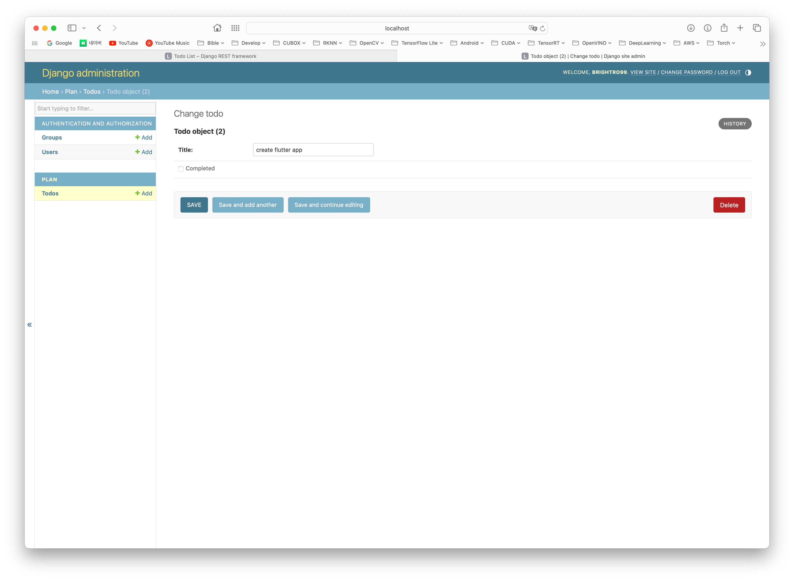
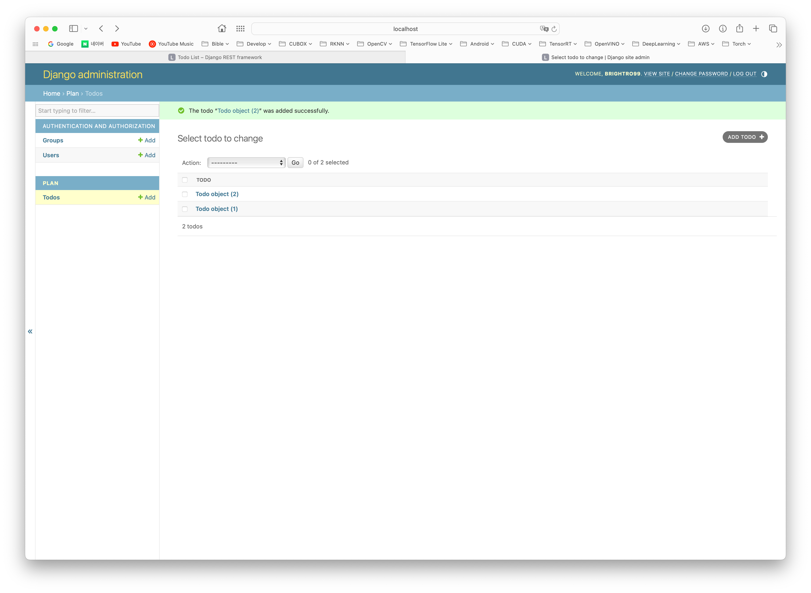
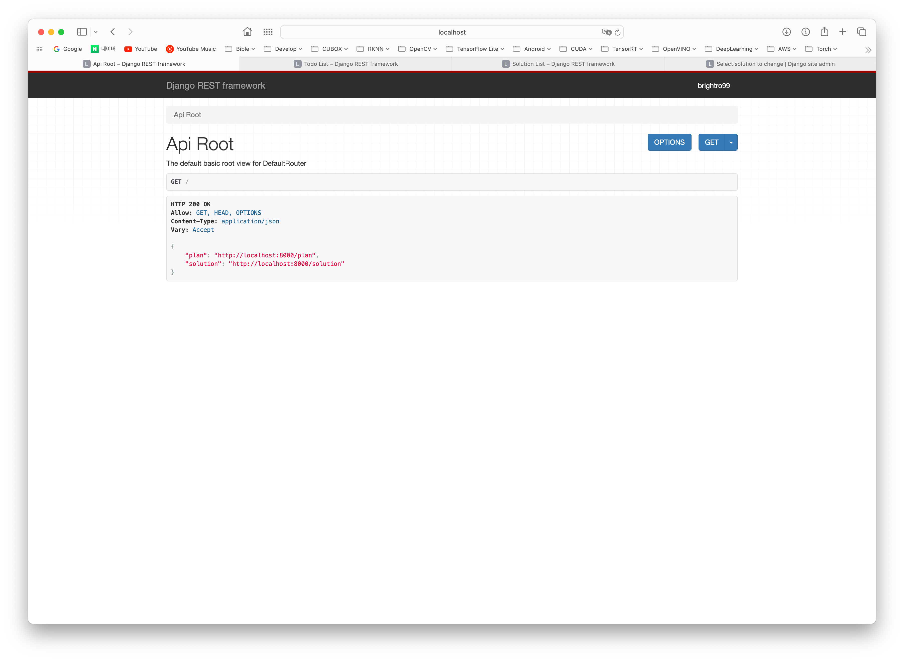
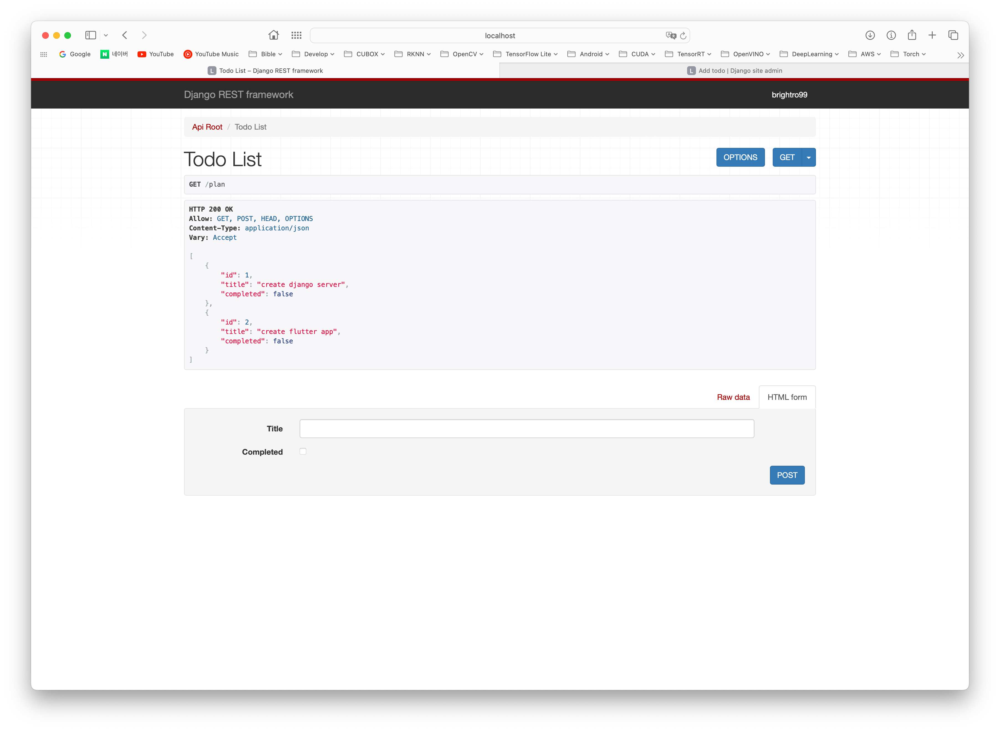
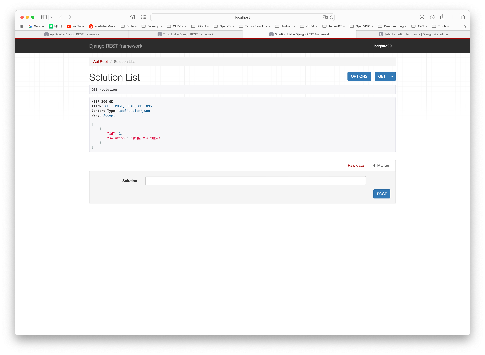

# Django & Flutter

https://youtube.com/playlist?list=PLsGh7Wc318kjAd93kqSw9O4xGuu4BZAHZ&si=X9DO2pJckUWQioDx

## Install
### Django
```
conda create --name django python=3.9
conda activate django
pip install Django
pip install djangorestframework
pip install markdown       # Markdown support for the browsable API.
pip install django-filter  # Filtering support
```
### Flutter
```
flutter pub add provider # https://pub.dev/packages/provider/install
flutter pub add http # https://pub.dev/packages/http/install
```
`pubspec.yaml` 에 보면 `dependencies` 에 추가 되어 있는 것을 확인 할 수 있다.

## Start
```
django-admin startproject django_api
python3 manage.py startapp plan
python3 manage.py makemigrations
python3 manage.py migrate
python3 manage.py createsuperuser
python3 manage.py runserver
```

## Page
### Admin Page
admin에서 todo 추가 장면
   
todo 추가 후 장면
   

### API Page
API Main Page (http://localhost:8000)
   
todo 호출 시 (http://localhost:8000/plan)
   
solution 호출 시 (http://localhost:8000/solution)
   
